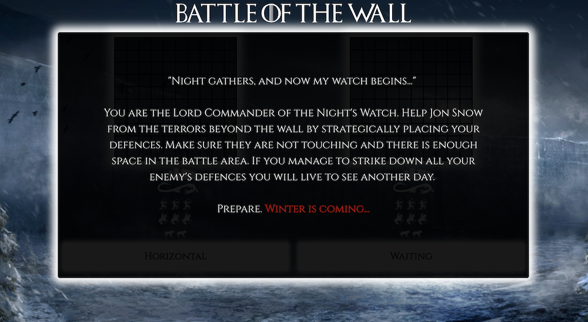
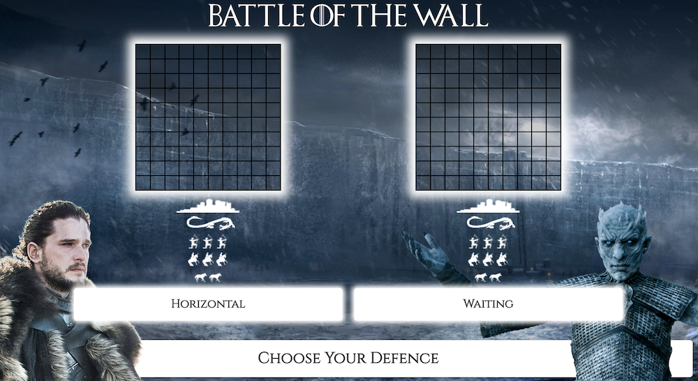
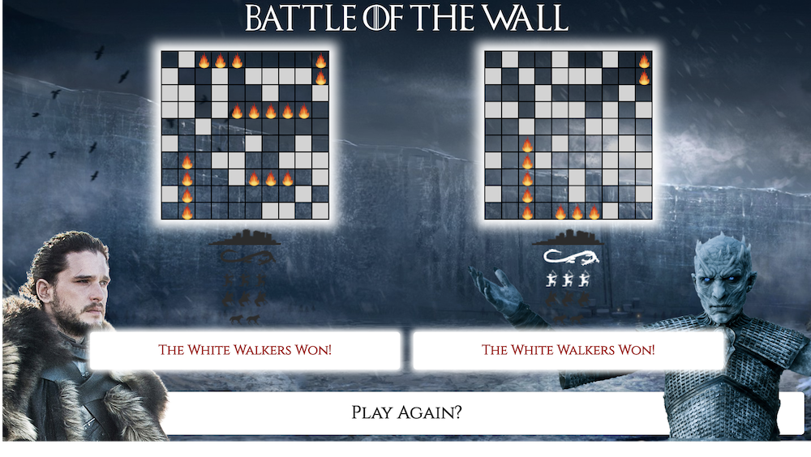
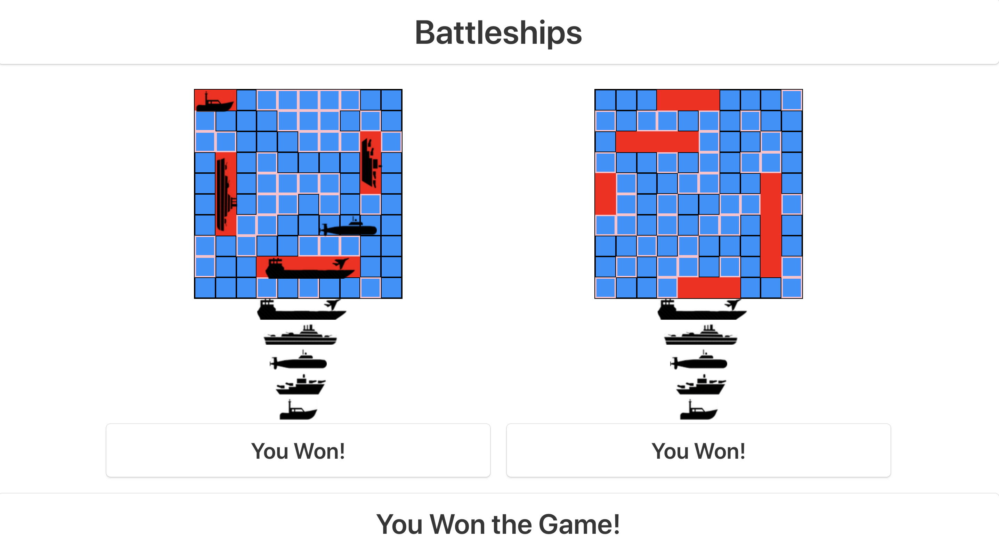

# General Assembly WDI Project 1: The Game

[Deployed Project Link](https://www.richard-turner.com/wdi-project-1/)

Battle of the Wall was my first project from General Assembly's Web Development Immersive course. It was an individual project built in just over a week, and was both my first game I had built and my first full project using Vanilla JavaScript, having only been studying it for two weeks.

Battle of the Wall is a Game of Thrones-themed variation on the classic game Battleships, a one-player game against the computer where the player and CPU covertly lay out their defences on separate game boards. The players then takes it in turns to try and guess each other's defence squares. Once a player has destroyed all of their opponent's defences they have won the game.

___

## Brief

I had to:

* **Render a grid-based game in the browser**
* **Switch turns** between the player and computer player
* **Design logic for winning** & **visually display which player won**
* **Include separate HTML / CSS / JavaScript files**
* Use **Javascript or jQuery** for **DOM manipulation**
* Use **semantic markup** for HTML and CSS (adhere to best practices)

Additional enhancements:

* **Create CPU logic** that intelligently hunts down the human player's defences
* **Add responsive design**

---

## Technologies Used:

* HTML5
* CSS3 (with animate.CSS)
* Sass
* Bulma
* Flexbox
* Vanilla JavaScript (ECMAScript6)
* Git
* GitHub
* Google Fonts
* Affinity Photos

---

## Screenshot Walk-through

### Intro page with story prelude.



### This leads to a screen where the human player can lay down their defences.



### Once the human player has laid down their defences on the game board, play can commence.


### Players then take it in turn to guess each other's defence squares. If they hit, they get another go.


### Once a player's has destroyed all their opponent's defences the game is over and the winner is displayed with the option to play again.



___

## Approach Taken

### Functionality

It was a 10x10 grid based game so I knew I had to create 2 blank arrays. Using a JavaScript loop and flexbox I created 100 divs for each array with the value of null.

Using JavaScript classes for both the players and the ships allowed me to efficiently store key information (i.e. ship hp points, player's remaining ships etc.) that could be accessed easily throughout the code.

The next challenge was to allow both the human and CPU player to lay down their choices, abiding by the rules of Battleships - defences should stay within the game board and shouldn't be touching. Using various 'checker' functions for both horizontal and vertical placement, this allowed both players to lay down their defences without any logic conflicts.

The actual game logic posed a few challenges, namely the computer AI that would have to guess human squares smartly, abiding by the rules of battleships. For instance, if a defence had been destroyed, it should ignore all other squares touching that defence as no other defence would be present there. It should also logically hunt subsequent squares once it makes an initial hit.

Once all defences had been destroyed the game should then display the winner and give an option to play again.

#### Featured piece of code 1

This piece of code generates the grid and numbers the squares accordingly. It allows for both the human player and CPU player to share the same function and label them appropriately using HTML classes and ID's, so they can be easily referred to later in the game. It also allows the human player to start laying down their defences on the game board using the addEventListener functionality.

``` JavaScript
function buildGrid(grid, player) {
  for (let i = 0; i < player.grid.length; i++) {
    newGridDiv[i] = document.createElement('div')
    newGridDiv[i].setAttribute('class', `${player.type}-div ${player.type}-active-div grid-div`)
    newGridDiv[i].setAttribute('id', `${player.type}-${i}`)
    newGridDiv[i].setAttribute('data-id', i)
    grid.appendChild(newGridDiv[i])
  }
  const userDiv = document.querySelectorAll('.user-div')
  userDiv.forEach(div => div.addEventListener('click', positionSelection))
}
```
### MVP

This is a screenshot of when I felt I had reached my minimum viable product as my game now met every requirement of the brief.



### Styling

At this point in production I had only done minimal styling and had mainly focused on the logic to make sure my game ran. Next I focused on styling the game to make it more visually appealing to the user and to give more feedback on their interactions.


#### Featured piece of code 2

The below Sass code is the styling of the intro prologue page giving the player some background story. The shadow effects and animation for .winter are particularly effective for creating a compelling intro.

``` Sass
.intro {
  z-index: +2; position: absolute;
  margin: auto;
  left: 0; top: 80px; right: 0;
  max-width: 80%;
  .intro-div {
    display: flex-wrap;
    align-items: center;
    text-align: center;
    justify-content: center;
    flex-direction: row;
    padding: 100px;
    height: 600px;
    background-color:rgba(0,0,0, 0.9);
    -webkit-box-shadow: 0px 0px 30px 14px rgba(255,255,255,1);
    -moz-box-shadow: 0px 0px 30px 14px rgba(255,255,255,1);
    box-shadow: 0px 0px 30px 14px rgba(255,255,255,1);
    color: white;
    font-size: 26px;
    .winter {
      color: #AA0000;
      font-weight: bold;
      cursor: pointer;
      animation-delay: 1s;
      -webkit-animation-duration: 2s;
      animation-duration: 2s;
    }
  }
}

```
___

## Wins and Blockers

A huge win was creating the game and CPU logic. It took great lengths to create concrete logic that wouldn't break after numerous tests and implement smart computer AI. I was also proud that I managed to achieve this with Vanilla Javascript (rather than relying on frameworks like jQuery). I am also proud of how the styling turned out and how professional it looks. People even mentioned that they thought it was an official game - which was a huge complement!

The biggest blockers were defence placement logic and computer logic. I feel my code could be refactored greatly as some logic feels like it repeats itself. The challenge was that I didn't want to refactor if there was any chance of it breaking the entire code. However, I heavily refactored the ship placement code into numerous functions, all given very descriptive names, to help with readability. Going back to that code was a lot easier once this had been done. These challenges really cemented my knowledge of Javascript - particularly for and while loops and classes.
___

## Future Features

There was quite a lot of future features I intended to add to the game but couldn't due to the strict time constraints. If I had more time to work on the project I would add:

* Further improve the animations and sounds of the game
* I would really like to improve the mobile and tablet responsiveness
* Refactor the code to make it more readable
* Other game modes such as human vs human player mode
___

## Key Learnings

Probably my biggest takeaway from this project was the importance or prioritisation and making sure key deliverables were worked on first before any bonus features. This meant that every day I would highlight the top 3 things I needed to work on, in order, and get those done before moving onto anything additional. This kept me on schedule to deliver the project in the timeframe provided.

I also realised the importance of refactoring and readability, as I found it hard to revisit some of my code at points, due to bad variable naming conventions and overly long functions. This is something I'm keen to improve upon in my following projects.
