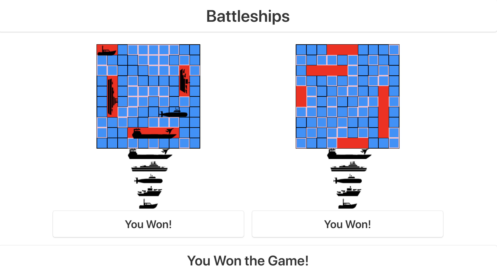

# General Assembly SEI Project 1: Battle of the Wall

[GitHub Pages](https://sohaveaniceday.github.io/wdi-project-1/)

[GitHub Repo](https://github.com/sohaveaniceday/wdi-project-1)

Battle of the Wall was my first project from General Assembly's Software Engineering Immersive course. It was an individual project built in a week, and was both my first game I had built and my first full project using Vanilla JavaScript, having only been studying it for two weeks.

Battle of the Wall is a Game of Thrones-themed variation on the classic game Battleships, a one-player game against the computer where the player and CPU covertly lay out their defences on separate game boards. The player then takes it in turns with the CPU to try and hit each other's defence squares. Once a player has destroyed all of their opponent's defences they have won the game.

___

## Brief

I had to:

* **Render a grid-based game in the browser**
* **Switch turns** between the player and computer player
* **Design logic for winning** & **visually display which player won**
* **Include separate HTML / CSS / JavaScript files**
* Use **Javascript or jQuery** for **DOM manipulation**
* Use **semantic markup** for HTML and CSS (adhere to best practices)

Additional enhancements:

* **Create CPU logic that intelligently hunts down the human player's defences**
* **Add responsive design**

---

## Technologies Used:

* HTML5
* CSS3 (with animate.CSS)
* Sass
* Bulma
* Vanilla JavaScript (ECMAScript6)
* Git
* GitHub
* Google Fonts
* Affinity Photos

---

## Screenshot Walk-through

### Intro page with story prelude


### This leads to a screen where the human player can lay down their defences


### After the player has laid down their defences on the game board, play can commence


### Players then take it in turn to hit each other's defences. If they hit, they get another go


### Once a player's has destroyed all their opponent's defences the game is over and the winner is displayed with the option to play again


___

## Approach Taken

### Functionality

It was a 10x10 grid based game so I knew I had to create 2 blank arrays. Using a javascript loop I created 100 divs for each array with the value of null. 

To begin the project I started work on my grid. I created a for loop that would use jQuery to create hundreds of numbered divs on my page and then it "cut out" the middle section I wanted to use. This gave me the grid size i wanted with each square having its own identifier number within it and meant that numbers at the edge of the grid weren't consecutive with numbers on the opposite side. This was intentional to stop movement over the edge of my map.

I then used objects to store the stats and location of my characters and worked on functions to handle their movement and attacks using the identifier numbers of my grid. All of this is controlled with the mouse and any changes that take place change the data in each characters object.

#### Featured piece of code 1

This piece of code generates the grid and numbers the squares accordingly. The large if statement selects the grid squares I wanted to keep for my game board. Further in my code all of the 'not-enterable' divs are removed from the page.

``` JavaScript
for(let i = 1; i < 600 ; i++){
  const $newDiv = $('<div></div>').addClass('not-enterable');
  $container.append($newDiv);
  if (i > 125 && i < 145 || i > 155 && i < 174 || i > 185 && i < 204 || i > 215 && i < 234
    || i > 245 && i < 264 || i > 275 && i < 294 || i > 305 && i < 324 || i > 335 && i < 354
    || i > 365 && i < 384 || i > 395 && i < 414 || i > 425 && i < 444 || i > 455 && i < 474){
    $newDiv.attr('class', 'grid-square');
    $newDiv.html(i);
  }
  if(i < 154 || i > 445){
    $newDiv.attr('class', 'not-enterable');
    $newDiv.html('');
  }
}
```
### MVP

This is a screenshot of when I felt I had reached my minimum viable product as my game now met every requirement of the brief.



### Styling

At this point in production I had only done minimal styling and had mainly focused on the logic to make sure my game ran. Next I focused on styling the game to make it more visually appealing to the user and to give more feedback on their interactions.


#### Featured piece of code 2

This piece of code was the styling for my explosion div which is placed on the page when a fireball spell is cast.

``` CSS
#explosion{
  animation: tada 2s infinite;
  background-image: url(images/boom.png);
  background-repeat: no-repeat;
  background-size: cover;
  background-position: center;
  height: 200px;
  width: 200px;
  background-color: transparent;
  z-index: 1;
  position: absolute;
}

@keyframes tada {
  0% {transform: scale(1);}
  10%, 20% {transform: scale(0.9) rotate(-3deg);}
  30%, 50%, 70%, 90% {transform: scale(1.1) rotate(3deg);}
  40%, 60%, 80% {transform: scale(1.1) rotate(-3deg);}
  100% {transform: scale(1) rotate(0);}
}

```
___

## Wins and Blockers


A huge win was building the game itself, and really pushing the limits of what I had learnt so far, especially with more complex CSS3 and jQuery. I am also very happy with the amount of replay value I feel the game has.

I think the biggest blocker was coming up with how I would keep track of all the various different stats and character data. There was so much important information the game needs to be able to run without encountering bugs that at first I was a bit lost with it all. Once I had come up with storing it into a series of useful objects I was then able to put those objects in to appropriate arrays and it became much simpler to know where each piece of data was stored.
I think this project really cemented my core knowledge of JavaScript especially array methods because of this.

___

## Future Features

There was quite a lot of future features I intended to add to the game but couldn't due to the strict time constraints. If I had more time to work on the project I would add:

* Further improve the animations and sounds of the game
* I would really like to improve the mobile responsiveness
* More variety in troop types, battle map or gameplay in general
* Other game modes such as the Cooperative mode I started work towards
